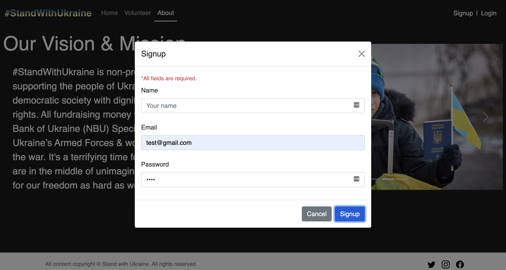

# #StandWithUkraine 🇺🇦

## Live Version [Click here](https://donation-ukraine.netlify.app/)

Non-profit donation website that provides a convenient way to contribute, not requiring travel, envelopes, or stamps for supporters to give help. This low barrier to entry means that any supporter with a computer, smartphone, or access to the internet can give the support from the comfort of their home.

## Audience

Canadian residents and people all over the world who want to support the Ukrainian army and donate for humanitarian aid.

## Tech Stack

### Front-end:

```
 HTML, CSS, JavaScript,Bootstrap.
```

### Back-end:

```
 Node.js, Express, MongoDB.
```

## Responsive design

```
Computer, tablet and mobile friendly design.
```

## User interaction:

### Donate 💵

Donate to the National Bank of Ukraine 🇺🇦


### Find a Volunteer 🕵️‍♂️

Send direct email


### Submit Volunteer Form👨‍💻

- Name
- Email
- About


### Signup/Login Form 📑

- Name
- Email
- Password




### Watch Video 📺

Watch Video on Youtube about Ukraine


### Share info 🚀

```
- Facebook
- Twitter
- Instagram
```


## Dependencies 💻

```
- Node.js
- Express
- Dotenv
- Bcrypt
- Cors
- Joi
- JWT
- Mongoose
```

## Getting Started 🏁

```
Install all dependencies(using nmp install command).
Run the development web server using the npm start command.
```
